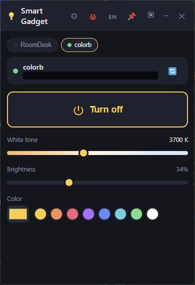
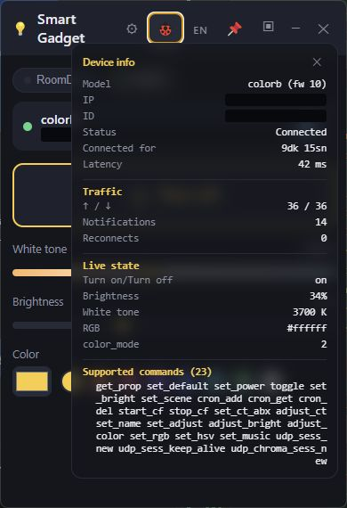
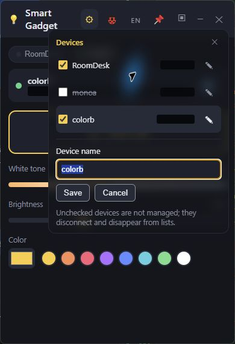
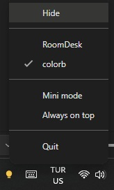

*English · [Türkçe](README.tr.md)*

# Smart Gadget

A small Windows desktop app to control Xiaomi/Yeelight smart lamps over your
local network: on/off, brightness, white tone, and color. Lives in the system
tray, has a compact **mini mode**, and can be pinned **always on top**.

## Screenshots

Captured from the running Windows app. Only the app window is shown;
network addresses and device identifiers are covered for privacy.

### Main window

Control the selected lamp, see its white temperature in Kelvin, and adjust
brightness or choose a color.



### Device information (debug)

Inspect connection status, latency, traffic, live lamp state, and supported commands.



### Device settings

Choose which lamps to manage and give saved devices your own names.



### Mini mode

Keep device selection, power, brightness, and color within reach in a compact strip.


### Tray mode

Keep device selection, power, and app mode selection



## Features

- 💡 **Yeelight control** — on/off, brightness, color temperature, and RGB color
  with preset swatches.
- 🌡️ **Live Kelvin value** — white temperature is shown next to the slider and
  updates as you adjust it. RGB/HSV operation is labeled as color mode.
- ✏️ **Device names** — rename lamps from **Devices → ✎ → Save**; names are
  remembered and appear in tabs, mini mode, and the tray menu.
- 🐞 **Device information** — view connection status, latency, traffic, live
  properties, and supported commands from the debug button.
- 🔎 **Auto discovery** — finds lamps on your Wi-Fi automatically; manual
  "add by IP" fallback if multicast is blocked on your network.
- ▣ **Mini mode** — shrinks the window to a compact strip with just power,
  brightness, and color.
- 📌 **Always on top** — pin the window over games/apps.
- 🔔 **System tray** — closing the window hides it to the tray; the tray icon
  shows lamp state and the right-click menu has quick on/off, mini mode, and
  always-on-top toggles.
- 🌐 **Turkish / English** — switch with the flag button; window position,
  mode, and language are remembered between runs.
- 📱 **Live sync** — if you change the lamp from the phone app, the desktop UI
  follows device notifications, with a 30-second polling fallback.

## Requirements

1. **Node.js** (LTS from [nodejs.org](https://nodejs.org)) — only for running
   from source; the packaged `.exe` (see below) needs nothing.
2. **LAN Control enabled on the lamp** — in the Yeelight (or Mi Home) phone
   app, open the lamp → settings → enable **"LAN Control"**. Without this the
   lamp refuses local connections.
3. The computer and lamp must be on the **same network**.

## Running

- Double-click `start.bat` (installs packages on first run, then starts), or
- `npm install` once, then `npm start`.

## Building a standalone .exe

```
npm run dist
```

This produces a portable `Smart Gadget.exe` under `dist/` with the app icon —
copy it anywhere and run it without Node.js.

## Troubleshooting

- **No lamp found:** check LAN Control is enabled and you're on the same
  network. Some routers block multicast between Wi-Fi clients ("AP/client
  isolation") — in that case use **Add by IP** with the lamp's IP address
  (visible in the Yeelight app or your router's device list).
- **Lamp stops responding during fast slider drags:** Yeelight limits devices
  to ~60 commands per minute; the app already throttles, but very long
  continuous drags may briefly hit the limit. Wait a few seconds.
- **Windows Firewall prompt:** when Windows asks, tick **both** "Private" and
  "Public" networks — many home Wi-Fi networks are categorized as *Public* by
  Windows, and discovery replies (UDP) get silently dropped otherwise. If you
  skipped the prompt, add an inbound allow rule for the app manually in
  "Windows Defender Firewall → Allow an app".

## License

Released under the [MIT License](LICENSE).
